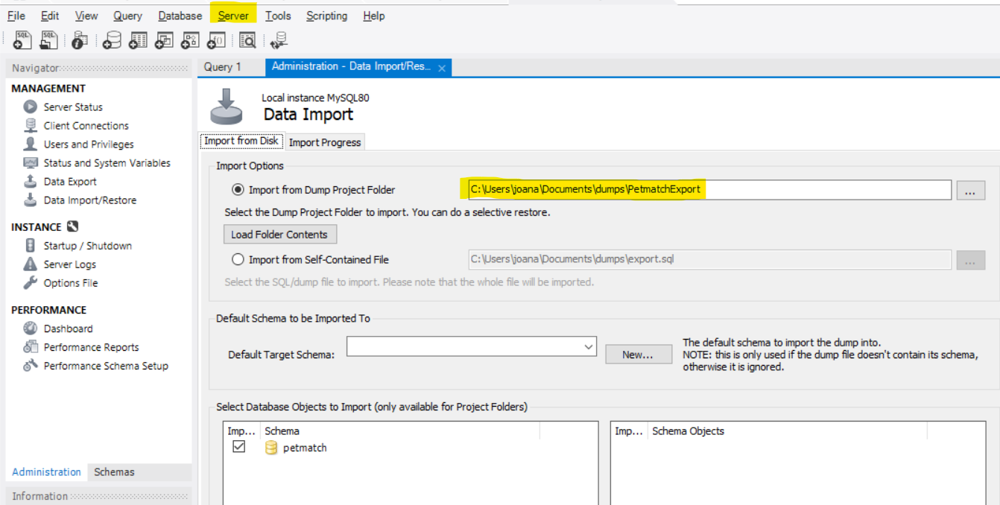

# Sistema de adoção de pets - PETMATCH
Esse projeto foi fruto da disciplina de Gerência de Projetos da Universidade Estadual da Paraíba.
A premissa do projeto é criar uma ponte entre ONGs para pets e possíveis donos que procuram um(a) companheiro!

## Ferramentas e passos necessárias para rodar o projeto
- MySql 8.x.x ou superior.
- Python 3.11 ou superior.
- Para instalar todos os pacotes necessários executar no terminal  pip install -r requirements.txt
- Para Usar a base de dados já alimentada do nosso projeto:
  - No MySQL Workbench,selecionar uma conexao
  - Ir na Server -> Data Import -> selecionar o local do PetmatchExport (que está logo abaixo da pasta instance) -> Import Progress -> Start Import
  -  
- No arquivo app.py na linha 22 é necessário botar as credeciais do mysql
  - Segue esse padrão : app.config['SQLALCHEMY_DATABASE_URI'] = 'mysql+pymysql://<nome_do_user_mysql>:<senha_do_user>@localhost/PetMatch'
- Para executar o sistema em si tem que rodar o arquivo PetMatch.py, no terminal vai aparecer a url http://127.0.0.1:5000
  - Caso a porta 5000 esteja ocupada só comentar a linha 8 e descomentar a 7, que vai ser executado na porta 5001, na url http://127.0.0.1:5001

## Credenciais
- No arquivo contas salvas.txt tem todos os admins, ongs e usuários cadastrados 
- Email e senha de cada um

## Rotas do Admin
- O admin possui a visão de todos os animais, usuários e ongs cadastradas no dashboard dele, logo após logar
- Ele pode cadastrar Ongs
- 
## Rotas do Usuário
- Cadastro na barra de navegação da home
- Login na barra de navegação da home
- Lista de pets na barra de navegação da home
- Lista de Ongs na barra de navegação da home
- Edição de perfil na página principal
- A visão do histórico de adoção na página principal
- Lista de chats iniciados na barra de navegação
- Ao clicar em redefinir senha na página de login um email com um link para o recuperação é enviado para o email cadastrado no petmatch, como aqui todas as contas foram criadas usando email temporário pra testar essa funcionalidade tem que ser criada uma nova conta
- Ao clicar em "pets para adoção" na barra de navegação, selecionar um animal e clicar em tenho interesse um chat vai ser iniciado com a ong que cadastrou o animal
- Na aba de /petList tem filtros de exibição de animais
- 
## Rotas do Usuário
- Visão de todos os animais cadastrados após logar com a opção de editar ou excluir o pet
- Na rota de edição ele tem a opção de reservar o animal ou adotar, ao clicar em mudar o status para adotado o campo de adotante vai mostrar uma lista de usuários que clicaram em "Tenho interesse" nesse pet
- O pet que tem o status adotado não aparece mais na lista de pets que os usuários tem acesso, os reservados ainda aparecem
- Opção de cadastro de animais na tela principal
- Lista de chats iniciados na barra de navegação, os chats só são iniciado pelos usuários 

## Chat simultâneo
- Para poder usar o chat como se fosse o user e a ong conversando ao mesmo tempo tem que logar em uma conta usuário em perfil do chrome, e em outro perfil do chrome na conta tipo Ong correspondente no chat
  - Ou só loga como user em um navegador e em outro navegador como a ong correspondente 

